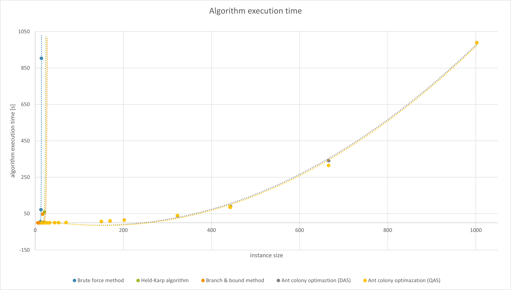
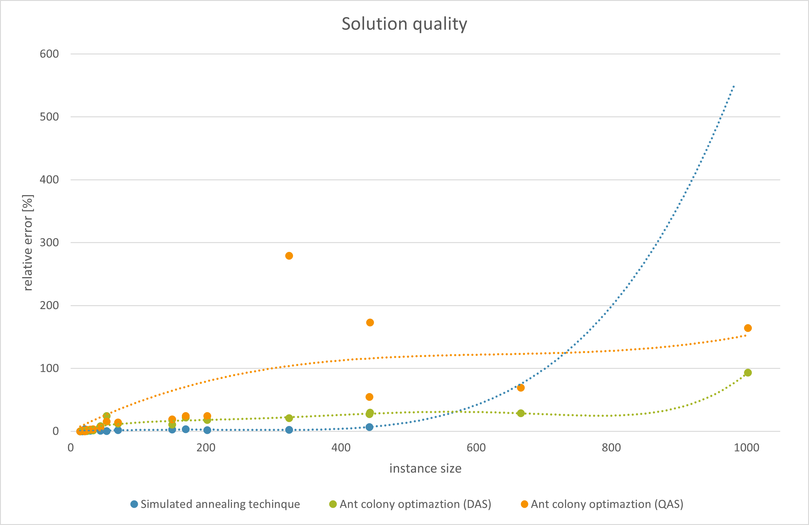

# Ant colony optimization

## Context

The project was created as one of the tasks during Effective Algorithms Design, during my studies
at [Wroclaw University of Science and Technology](https://pwr.edu.pl/en/).

## Introduction

The task aimed to create the implementation of an algorithm for solving TSP based on
the [Ant colony algorithm technique](https://en.wikipedia.org/wiki/Ant_colony_optimization_algorithms).

The process of verifying the accuracy and correctness of created algorithm was based on the test instances from the
following sources:

- [1st source](http://jaroslaw.mierzwa.staff.iiar.pwr.wroc.pl/pea-stud/tsp)
- [2nd source](http://jaroslaw.rudy.staff.iiar.pwr.wroc.pl/files/pea/instances.zip)
- [3rd source](http://elib.zib.de/pub/mp-testdata/tsp/tsplib/tsp/index.html)

The instances are also available in the `src/main/resources/instances` directory in this repository.

## Algorithm variants

The source contains implementation of 2 `pheromone distribution systems` :

- **DAS** (*ants density*) - the amount of distributed pheromone is proportional to the cost of edge between two nodes (
  constant amount of pheromone per length unit)
- **QAS** (*ants quantity*) - the amount of distributed pheromone is inversely proportional the cost of edge between two
  nodes (constant amount of pheromone per edge)

## Application functionality

Application features single mode called `Launch experiment`. The mode enables user to perform experiment based on the
data stored inside of `configuration file`. The experiment procedure measures average values of execution time and
relative error and saves them in `output file`.

### Configuration file

The configuration file should have .ini extension. The required format presents as follows:

`[das]`  
`alpha`   
`beta`  
`rho`

`[qas]`  
`alpha`   
`beta`  
`rho`

`[name]`  
`solution`

where:

- `das` - section containing configuration data for DAS pheromone distribution system
- `qas` - section containing configuration data for QAS pheromone distribution system
- `alpha` - key determining algorithm greediness
- `beta` - key determining local criterion function influence (here *visibility heuristics* is being used)
- `rho` - key determining pheromone evaporation factor
- `name` - section containing instance name e.g. `gr17.tsp`
- `solution` - key containing MHP for given instance

### Output file

The results of the experiment will be solved in `results.txt` file. The output file presents as follows:

`name` `a0` `b0`   
`name` `a1` `b1`  
(...)

where:

- `name` - name of the file containing test instance
- `a0` - average time (DAS pheromone distribution system)
- `a1` - average time (QAS pheromone distribution system)
- `b0` - average absolute error (DAS pheromone distribution system)
- `b1` - average absolute error (QAS pheromone distribution system)

## Instance format

The instances in the application are loaded from the .txt files. The instances represent graphs as the adjacency
matrices. The required format of the instance presents as follows:  
`name`  
`x` `x` `x`  
`x` `x` `x`  
`x` `x` `x`  
`solution`

where:

- `name` - name of the instance
- `x` - weight of given edge
- `solution` - Minimal Hamiltonian path (TSP solution) (optional parameter)

## Research results

The experiment has been carried out at 24 January 2022. The experiment results has been presented on the following
charts.

